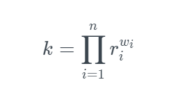

# 介绍


陀螺仪DAO负责启动陀螺仪系统，并决定有哪些机制应该被纳入最终设计中。本文件描述了FTL实验室通过学术研究和开发制定的理论设计机制

如果文档有任何翻译错误和不清楚的地方，请通过Github向[Gyroscope-CN存储库](https://github.com/darktuJJ/GitBook/tree/Gyroscope-CN)提交合并请求。


### 陀螺仪协议

陀螺仪协议的使命是为DeFi建立强大的公共基础设施，其核心部分是一个有充分支撑的稳定币，具有充分的储备支撑和受算法上的价格约束。

* **全额抵押的稳定币**：Gyroscope 稳定币的目标是实现 100% 的长期储备率，即每单位稳定币都由价值 1 美元的抵押品支持。
* **全天候的储备**：储备是一篮子由协议控制的资产，共同为已发行的稳定币提供抵押。初期，大部分资产将是其他稳定币。储备的目的是最大程度地分散 DeFi 中的各种风险。它考虑的不仅是价格风险，还包括审查制度、监管、交易对手、预言机和治理风险。
* **自主价格约束**：铸造和赎回稳定币的价格是自主设定的，旨在在面对短期危机时，平衡维持紧密锚定与项目长期可行性的目标。


陀螺仪协议已在以太坊上推出


### 核心稳定性机制

**场景 A：稳定币价格高于面值**

如果价格升至锚定价之上，可以铸造更多的稳定币并在市场上出售，所得收益将增加储备金。这实际上是在上涨过程中形成了一个封闭的套利循环。


在协议的未来迭代中，可以添加更多的编程逻辑来应对短暂的市场事件（例如对其他稳定币失去信心），否则这些事件可能对 Gyroscope 产生过大的和不可预测的影响。

通过衡量资金的流入和流出，可以建立两项额外的风险控制措施：\
（1）铸造和赎回的动态费用，\
（2）临时禁用铸造的断路器。这些风险控制可以在协议的后续版本中进一步探索其潜在用途。


**场景 B：稳定币价格低于面值**

根据储备价值是否覆盖 100% 的稳定币供应，这种情况会有不同的表现：

* **在储备充足的情况下**，存在与上涨时相同的套利循环。可以在市场上购买稳定币，并以价值 1 美元的储备资产进行赎回。这是默认情况，由第一道防线——全天候储备设计所支持，使资产支撑尽可能稳健。
* **如果储备遭受重大冲击**，还存在额外的防线，包括自主的价格约束，以保护储备并维持系统的长期稳定性。

### 协议防御线

#### 存在多道防线以维持稳定的系统：

**为了维持系统的稳定性，设计了多重防线。第一道防线是全天候储备**，它储存了所有的发行收益，并尽可能地分散了 DeFi 中的各种风险。其目标是在默认情况下实现完全抵押。全天候储备不仅分散了价格风险，还涵盖了审查制度、监管、交易对手、预言机和治理等风险。


虽然储备金最初将几乎完全由其他稳定币组成，但在长期内可能会有所变化。只有在其他DeFi系统出现重大问题时，才会对储备金产生巨大的冲击，在这种情况下，陀螺仪将致力于提供最好的解决方案，并防止最坏的结果发生。


<figure><figcaption>
陀螺仪稳定币初始储备的可视化图。实际储备可能会随着时间的推移而变化。
</figcaption></figure>

**如果储备金遭受重大冲击，那么第二道防线——Gyroscope 的自主定价机制将会生效。**如果稳定币单位变得抵押不足，赎回市场的债券曲线将提供递减的赎回报价，作为一种断路器，以维持系统的可持续性。这个稳定机制应该很少需要，但作为应急计划而存在，并利用了 Gyroscope 的多市场设计，将流动性集中在稳定币铸造/赎回债券曲线的价格范围内。

递减赎回报价的目标是抑制银行挤兑和对货币锚定的攻击，并奖励那些以可持续方式等待短暂低迷期过去的用户。虽然稳定币持有者的退出能力得以保留，但重要的是，Gyroscope **提供了理由去押注稳定币将回归其目标价格**，因为当资金流出回归平衡（趋近于零）或储备金恢复（例如，通过收益）时，赎回价格将自主地回升至锚定价


用户会对稳定币的**基本价值**形成信念。这些信念基于储备金的价值，以及稳定币被广泛接受和使用的程度。但用户也会对其他市场参与者的信念形成预期（以此类推）。**Gyroscope 协调了这些信念**。由于储备金的价值以及其使用规则都是链上可观察的，理性的用户在是否攻击或防御锚定价的问题上会达成隐性的共识，因为只有当他们属于多数时才能获利。这样做的目的是**预防信心危机**。


**第三道防线包括允许储备金恢复或扩大资产支持的机制**。举例来说，储备金可以通过拍卖治理代币来进行再资本化。事实上，Gyroscope 的治理机制有动力在适当的时机这样做，以建立针对冲击的资产缓冲，而不是仅在危机期间充当最后的后盾。Gyroscope 的机制还与杠杆贷款机制（如 Maker）并行工作，以增强稳定性。

### 配套基础设施

Gyroscope 的设计衍生出了额外的产品。例如，一个能够承受资产故障的高流动性 DEX（去中心化交易所）自然地源自 Gyroscope 的设计。这个设计可以被概念化为一个由二级市场自动做市商、储备池和外部池组成的网络，能够实现交易的高效路由。**GYD 交易池**是在 Gyroscope 稳定币内外进出的冗余的、高度流动性的路径，而**动态稳定机制（DSM）**则是铸造和赎回市场。要获得更详细的解释，请阅读 DSM 和 GYD 交易池的描述。

<figure><figcaption>
相关陀螺仪市场的示意图
</figcaption></figure>
