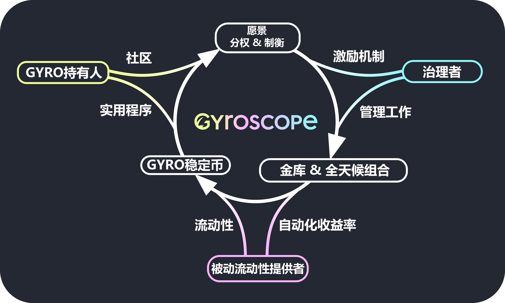

# 治理的基本要素


这些文档描述了通过学术研究和开发制定的 Gyroscope 设计机制。Gyroscope 的设计是完全去中心化的，Gyro DAO 负责决定哪些机制应被纳入最终设计并启动 Gyroscope 系统。


#### Gyroscope 的设计是为了在不同的参与者之间建立一个良性的循环：

* Gyro Dollar 持有人
* 治理者
* 被动流动性提供者（LPs）

请继续阅读并了解陀螺仪的设计如何促进这种良性循环。

### 什么是**治理可提取的价值（GEV）**

目前，某些 DeFi 系统中的治理者有可能是短视的，像政治家和银行家一样只关注短期回报而不是长期利益，当然，他们也可能是彻头彻尾的恶意行为，特别是在 DeFi 中，治理者几乎都是匿名的。我们将这些短期和恶意利用的行为统称为治理可提取价值（GEV），为了维持安全的 DeFi 协议，需要尽量减少这些问题。请阅读我们关于[GEV的文章](https://ournetwork.substack.com/p/our-network-deep-dive-2)和我们的[DeFi论文](https://arxiv.org/abs/2101.08778)（第V.C和VI.B节）。

### 治理的再创新

在学术研究的推动下，Gyroscope 引入了开拓性的治理机制，可作为对GEV的制衡的手段，通过最大限度地减少（GEV）来帮助治理者与协议的长期利益保持一致。

那么是如果做到的呢？在任何运作良好的算法稳定币中，总有人为每个新铸造的稳定币支付1美元，但这1美元的去向是很关键的。在当前的设计中，这1美元会有一部分或全部进入了某人的口袋：比如，拥有铸币税股份的股东。对于协议的长期利益来说，这是错误的。它减少了治理者在游戏中的利益，而最好的方案是增加他们的利益。只要耕种的收益在短期内足够大，他们不必在意如果不及时退出，他们将失去的那点利益。

Gyroscope 的设计则不同，长期来看，去中心化的 Gyroscope 系统可能会产生运营现金流，一个关键的设计问题是如何分配这些现金流以激励代理人。

Gyroscope 提出了一个新的治理元素，称为 "[有条件现金流](有条件现金流.md)"，这将会使治理者在未来获得与系统健康相关的奖励，该机制的运作方式是在协议储备中保留业务现金流，如果系统保持健康，在未来的时间里解锁与这些现金流有关的奖励给治理者，如果系统变得不健康，现金流将被默认保留以维持系统的健康状态。治理者负有管理和策划协议储备的重要职责，他们被阻止做出危险的决定，因为这将使他们目前的奖励面临风险（例如：与银行家相比，如果银行倒闭，他们不必归还奖金）。如果局势良好，治理代币的估值高得离谱，治理者就有理由提前拍卖新的代币以提高储备。

但是，我们怎么知道治理者不会以其他方式滥用权力呢？Gyroscope 提出了另一种新的治理元素，称为 "[乐观治理](乐观治理.md)"，它通过一个制衡系统将治理者引向这条道路。在这个机制中，如果治理者试图偏离协议的共同愿景，Gyro Dollar 持有者可以在时间锁定期间有选择性的行使否决权来阻止它。通常情况下，如果治理提案是合理的，Gyro Dollar 持有人不需要做任何事情；如果治理行动是有争议的，Gyro Dollar 持有者可以行使否决权，如果有足够多的人这样做，该提案就会被阻止。

Gyroscope 是赋予社区管理他们自己资金的权力，它提供一流的机制来实现这一点。**公平和去中心化**是治理代币分配的首要任务。
