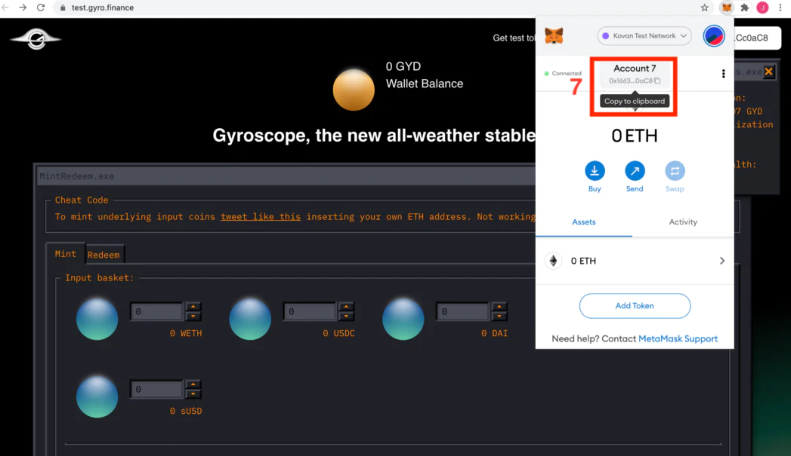

# 游戏化测试网教程




重要提示：截止到目前，由于陀螺仪游戏化测试网是基于Balancer V1部署，Balancer V1前端错误导致部分教程已经失效，受影响的测试级别包括LV1和LV2！虽然不能继续测试 但是通过对本教程的阅读可以让您对陀螺仪协议机制有一定的了解！


### 入门 

为了使用陀螺仪--或其他任何能够在区块链上的应用（即“**dApp**”）--你必须与智能合约进行交互。MetaMask是一个浏览器扩展钱包，可以轻松访问大部分dApp生态系统。

→ 了解如何：[**安装 MetaMask**](https://metamask.io)。



请务必记住，在创建 MetaMask 帐户时，你的**秘密恢复短语**（**助记词**）比你设置的密码要重要得多。**秘密恢复短语**（**助记词**）由 12 个随机生成的单词组成，构成您的钱包恢复密钥。

→ 了解更多关于你的：**秘密恢复短语（助记词）**。




**重要提示**：不要与任何人分享你的秘密恢复短语（助记词），并把它放在一个安全的地方。


### 使用陀螺仪 

Gyro是DeFi生态系统的一个价值稳定的记账单位（即货币）。它是有资产支持的，基于规则的，旨在保持流动性。要了解这些机制如何运作，你可以[阅读](../陀螺仪协议/核心要素/互补性的稳定机制.md)或观看：



→ 了解更多：[**陀螺仪**](<../README (1).md>)。

陀螺仪协议目前仍在建造和测试中。为此，我们构建了一个游戏化的测试产品，它使用测试货币进行测试。这个早期版本在[以太坊](https://ethereum.org/en/developers/docs/networks/)的[Kovan 测试网](https://ethereum.org/en/developers/docs/networks/)上运行。截至目前，四个测试网级别已上线。每个级别由几个子任务组成。目标是创造一个可以轻松有趣地探索陀螺仪协议机制的环境。

→ 了解更多信息：[**陀螺仪测试网分析**](https://medium.com/gyroscope-protocol/gyro-testnet-analytics-6ef5812727a2)。

### 加入 Gyro 测试网 

**第 1 步**：通过访问[https://test.gyro.finance/](https://test.gyro.finance)开始。

 (1).jpg>)

* 点击连接钱包（Connect Wallet）。
* 选择MetaMask。

.jpg)

* 您将收到一条错误消息，指出“Error: network 1 not supported. Please use Kovan”。
* 单击浏览器中的扩展列表中的MetaMask。
* 单击 MetaMask 后，通过单击当前选择的“以太坊主网”来选择网络。
* 在下拉列表中选择“Kovan测试网络”。

**第 2 步**：获取测试网令牌

* 复制您的地址并发布一条[这样的推文](https://twitter.com/ljfgudgeon/status/1379205575943290880)，将“0x...”替换为您的地址或[加入我们的discord](https://discord.gg/w9D9XxrEa5)，并在通过验证码验证后将您的钱包地址发布到[#♨｜testnet-faucet](https://discord.com/channels/818492571214807040/830866721199882270)。

**第 3 步**：参与我们的关卡

### Gyrosoft 游戏化测试网总览： 

#### 等级1--等级3视频教程： 



#### 等级1： 

如何玩 1 级

.jpg)

* 通过将您的一些测试代币存入 Gyroscope 储备金来铸造 Gyro。在上面的例子中，存入了 100 USDC、100 DAI、100 BUSD 和 99 sUSD 来铸造了大约 448 GYD。

.jpg)

* 点击“[添加流动性](https://kovan.pools.balancer.exchange/#/pool/0x6eae312f00b4ee0640bf4e3d0a08cda36f206bcc/)”
* 为多重资产池（Multi asset）或者单一资产（Single asset）提供流动性
* 单击“I agree”。[在此处](https://academy.binance.com/en/articles/impermanent-loss-explained)阅读有关向流动性池供应资产的风险的更多信息

.jpg)

* 点击 “Set up proxy”.
* 确认MetaMask中生成的交易。重复这个过程来解锁 GYD 和解锁 USDC。你可能想检查添加流动性是否成功。你可以在[这里](https://test.gyro.finance/game)确认是否完成，如果您没有收到相应的**✓**，请再次重复这一过程，添加流动性并确认所创建的MetaMask交易。

#### 等级2： 

* 在 USDC-GYD[平衡器池上](https://kovan.pools.balancer.exchange/#/pool/0x6eae312f00b4ee0640bf4e3d0a08cda36f206bcc/)，单击右上角的“添加流动性”。

.jpg)

* 选择“单一资产”，然后向池中添加一些USDC。下面，我添加了 905 USDC。**（TX1 哈希）**

.jpg)

* 移除您刚刚添加的流动性，但全部为 GYD（而非 USDC）。\
  点击右上角的“移除流动性”，然后像之前一样点击“单一资产”。选择提取最大的 GYD。

下面可以看到，对于存入的 905 USDC，该池允许提取 925.658 GYD。按“移除流动性”并确认 MetaMask 交易。

.jpg)

现在，对于您存入的每个 USDC，您最终应该获得 >1 GY

*   转到[P-AMM](https://test.gyro.finance)并通过转到兑换选项卡和 USDC 字段，将您刚刚从池中提取的 GYD 数量（在我的例子中为 925）兑换成 USDC。**（TX2 哈希）**

    交易完成后，您最终会得到一个新的、高于您开始循环的金额的 USDC 余额。就我而言，我从 905 USDC 开始，通过套利赚取 20 USDC，使我的最终余额达到 925 USDC。
* 要验证套利循环，请在MetaMask中选择交易哈希。**TX1 哈希**和**TX2 哈希**已在上面以粗文本标注。

#### 等级2.5： 

.jpg)

* 输入您的任何一种或所有社交数据。您可以选择添加 **Salt** 以进一步保护您的信息。

（说明：**Salt**这一项基本上你要填什么都可以，比如说你可以填一个单词，apple，或者一连串单词，或者随机的字母符号组合都可以，如果你填入了内容，你一定要记住你填了什么，对保密性要求高，就设一个复杂的salt，如你不在乎，不用填写任何salt也可以。

* 确认 MetaMask 生成的交易，确认后请勿刷新页面！

.jpg)

* 下载 .json 文件并将其存储在安全的地方

#### 等级3： 

* 首先，创建一个[论坛帐户](https://gov.gyro.finance)并导航到“摘要”。



* 然后在论坛“个人资料”的“关于我”部分输入您正在使用的 Kovan 地址。



* 熟悉治理机制（[**在这里阅读提案**](https://gov.gyro.finance/t/final-proposal-on-ggwp-1-bootstrapping-the-dao-and-giving-ftl-labs-a-mandate-to-build-gyro-v1/32)）
* 通过 GGWP-1 上的快照进行投票（[转到快照](https://snapshot.org/#/gyrodao.eth)并加入空间）



在此处投下您的信任票并通过第一个陀螺仪治理工作提案：[链接](https://snapshot.org/#/gyrodao.eth/proposal/QmeMYwoCCEhSk8E7BNshU2XeSD91RVdLrkkv3mSV2EApTe)。

#### 等级4： 



青蛙游戏邀请卡

您可以选择在[推特](https://twitter.com/darktuhwj123/status/1462258373877899267)上发布带有以下文字的邀请卡以接受青蛙游戏的邀请并分享乐趣：

Not a bot, but a player in @GyroStable’s Frog Games.

#### 挑战一

第一个挑战是加密领域的老手们——如果你参加了一个大型的、面对面的以太坊活动并收集了相应的出席证明协议 ( [POAP](https://poap.xyz) )，你可以签署一条消息，声明你的钱包并收集你的第一个Sybil点数。

**如果您认为自己可能符合条件**，请在[MyCrypto.com](https://app.mycrypto.com/sign-message) 上连接您的钱包（避免使用 Coinbase 钱包，它似乎不能正常工作）并且：

在消息字段粘贴你在测试网中使用的 Kovan 地址

使用拥有 POAP 的地址对消息进行签名并验证您的所有权

.jpg)

复制签名后的消息并粘贴到[游戏UI](https://test.gyro.finance/game)的相应字段中

.jpg)

### 我接下来可以做什么？ 

* 在[Twitter @GyroStable](https://twitter.com/GyroStable)上关注我们！
* 加入我们的[Discord](https://discord.gg/2vnqnS7wE6)并提出任何问题或建议！
