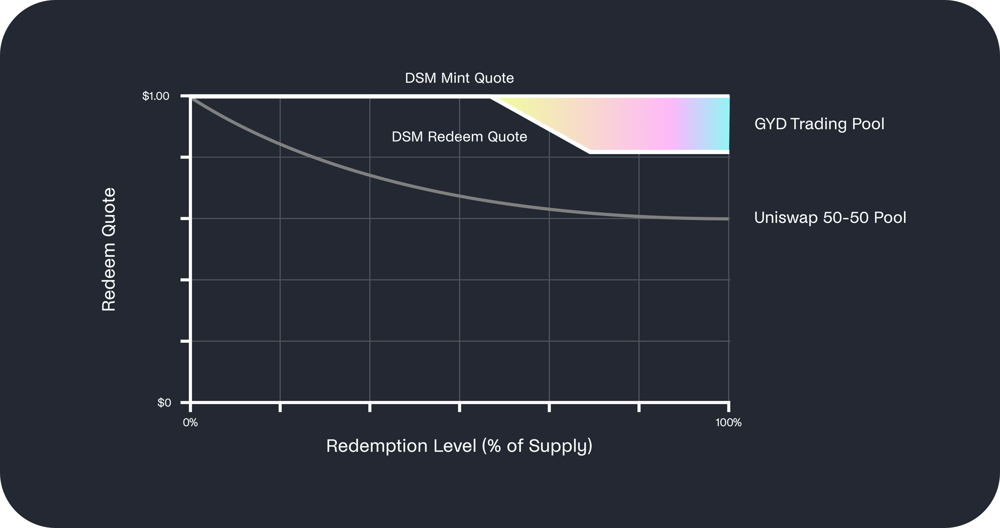

# GYD交易池

概述

在 Gyroscope 系统中，GYD 交易池将流动性集中在由 DSM 设定的铸造和赎回报价范围内。

在储备充足的情况下，GYD 交易池的流动性会集中在一个较窄的区间内。如果储备遭受冲击，将引发 DSM 设定新的赎回价格（如前文所述），该价格区间将会扩大。值得注意的是，**GYD 交易池的流动性提供非常有韧性**，因为：

* GYD交易池是**冗余的**（即为 GYD 提供不同的进出路径 ）。
* GYD交易池彼此**独立**（例如，如果某个配对资产失效，剩余的 SAMM 池仍可继续运作，这不同于一个通用的 Curve 池）。

### GYD交易池赎回曲线示意图

下图展示了简化的 GYD 交易池赎回曲线，并以 50-50 的 Uniswap 池为例进行说明：

<figure><figcaption>
GYD 交易池赎回曲线示意图
</figcaption></figure>

GYD 交易池设计结合了优化的联合曲线形状和虚拟储备机制。这些设计已在多个文档中得到完整的定义、正式描述，并进行了优化，[这些文档可以在 Github 上查阅](https://github.com/gyrostable/technical-papers/tree/main/E-CLP)。
