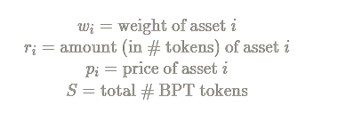
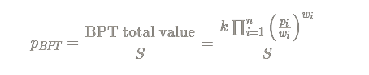

# BPT预言机


到现在为止，预言机的文档只有英文版本。


为了给LP代币定价，仅仅把池子里所有资产的价值加起来是不够的，因为这很容易被操纵。我们使用一个更强大的程序来计算Balancer LP代币的价值。

对于一个包含资产1，...，n 的特定平衡器池，定义如下：

平衡器池的常系数之积是：

请注意，这些金额"𝓇𝒾"易于操纵，但积"k"则不然。同时，因我们从其它地方获取资产的定价，所以我们可以假设价格"𝓅𝒾"也是不易操纵的(我们会在其他地方讨论防止价格操纵的措施）。

为了制造抗操纵的BPT预言机，只需用抗操纵的变量“𝓌𝒾” 、"𝓅𝒾"、"k"、"_S"_来表达BPT代币的定价。

平衡器池的组合价值可以计算为：

反过来，BPT价格可以计算为：

